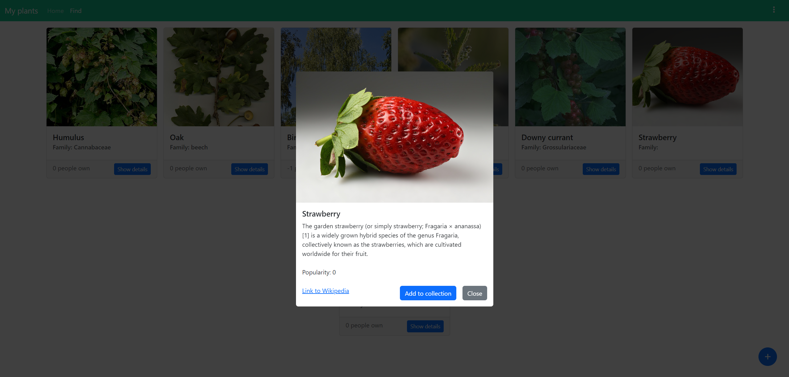

# MyPlants

## About

My first angular app 😄. Very basic app in which user can add plants to his/her collection. In app you are able to :
 - add and remove plants from your collection
 - add new plants 
 - see a popularity of an plant in the app

## Images

## Main features to be developed
- Viewing all species ✅
- Viewing your collection of plants ✅
- Adding plants to your collection ✅
- Adding plant species✅
- Searching through database of species

## Tech stack
- Angular
- Firebase
- Bootstrap 5
- Typescript
- Sass
- Coffee

This project was generated with [Angular CLI](https://github.com/angular/angular-cli) version 15.2.4.

## Development server

Run `ng serve` for a dev server. Navigate to `http://localhost:4200/`. The application will automatically reload if you
change any of the source files.

## Build

Run `ng build` to build the project. The build artifacts will be stored in the `dist/` directory.

